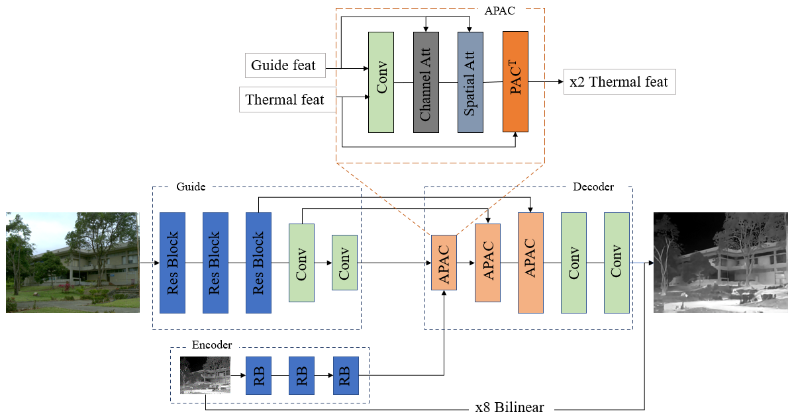

# TUPAC: Thermal Image Upsampling with Pixel Adaptive Convolutions
### [Paper](https://openaccess.thecvf.com/content/CVPR2023W/PBVS/papers/Rivadeneira_Thermal_Image_Super-Resolution_Challenge_Results_-_PBVS_2023_CVPRW_2023_paper.pdf) | [Workshop](https://pbvs-workshop.github.io/index.html) | [Challenge Link](https://pbvs-workshop.github.io/challenge.html) | [Leaderboard](https://codalab.lisn.upsaclay.fr/competitions/9666#results)

## Overview
Code for CVPR-23 Workshop Challenge - Guided Thermal Image Upsampling Challenge submission.


### Details:
* This work and code is largely based on [Pixel Adaptive Convolutions](https://github.com/NVlabs/pacnet/tree/master).
* We modified and added following changes to get sharper upsampled thermal images from misaligned guide and low-res inputs.
  * Attention block that reduces the impact of misaligned guide features.
  * SSIM-loss function training to prevent pixel-level misalignment issues while training.
  * New test time augmentation: Blurring the guide image to reduce the effects of noise and misalignment.

### Installation:
* Use a conda environment with python>=3.6
* Install the required packages from requirements.txt

### Training:
* Download the dataset splits from the challenge website [here](https://codalab.lisn.upsaclay.fr/competitions/9666#participate)
* Create txt files containing train, validation, and test file splits and point them to their respective paths in the args.
* Sample training command: 
```
python main.py --mode train --model PacJointUpAtt  --data-root /path/to/dataset/ --train-filenames train_list.txt --val-filenames val_list.txt --exp-root path/to/checkpoints/ --measures psnr ssim --batch-size 4 --train-crop 40 --epochs 2000 --lr-steps 200 400 600 1400 --loss ssim
```

### Testing:
* Use the pretrained model from the repository and generate outputs using the custom ensemble.
* Sample testing command:
```
python main.py --mode test --model PacJointUpAtt --data-root /path/to/dataset/ --dump-path /path/to/output --load-weights weights/0228_bilinear_att_ft_weights_epoch_1653.pth --measure psnr ssim --dump-outputs --ensemble
```

### Final Leaderboard:
| Method        | PSNR  | SSIM   |
|---------------|-------|--------|
| [zhwzhong](https://codalab.lisn.upsaclay.fr/competitions/9666#results)  | 31.04 | 0.9036 |
| [lengyu.yb](https://codalab.lisn.upsaclay.fr/competitions/9666#results) | 29.41 | 0.8727 |
| Ours          | 28.78 | 0.8582 |

